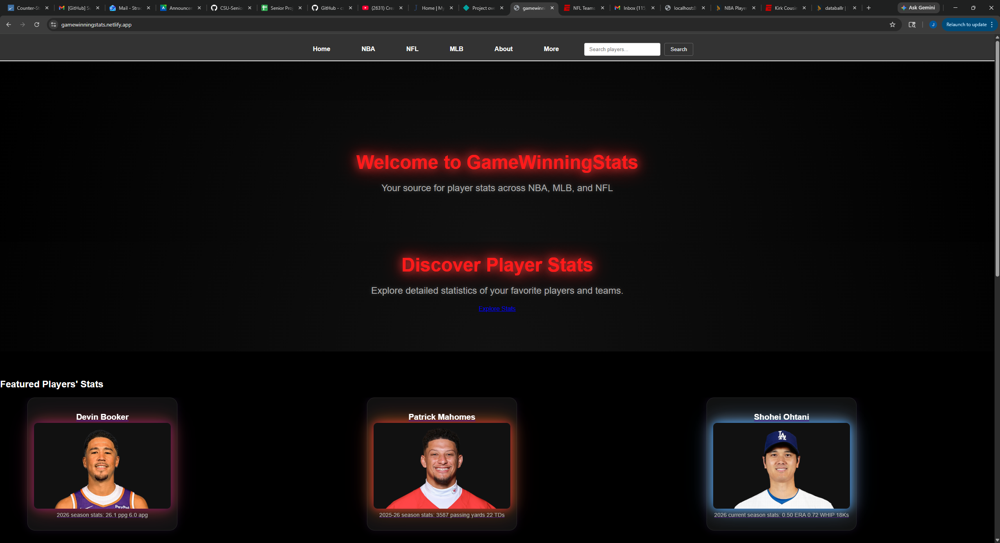
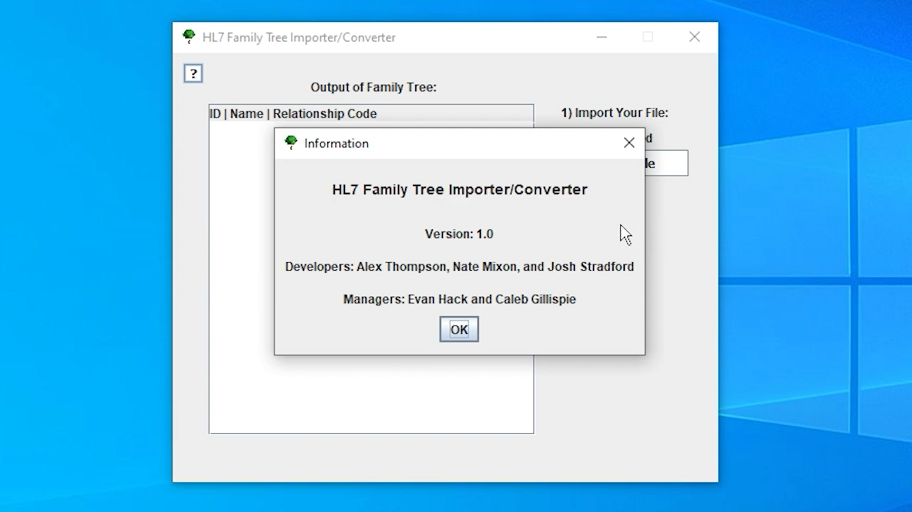
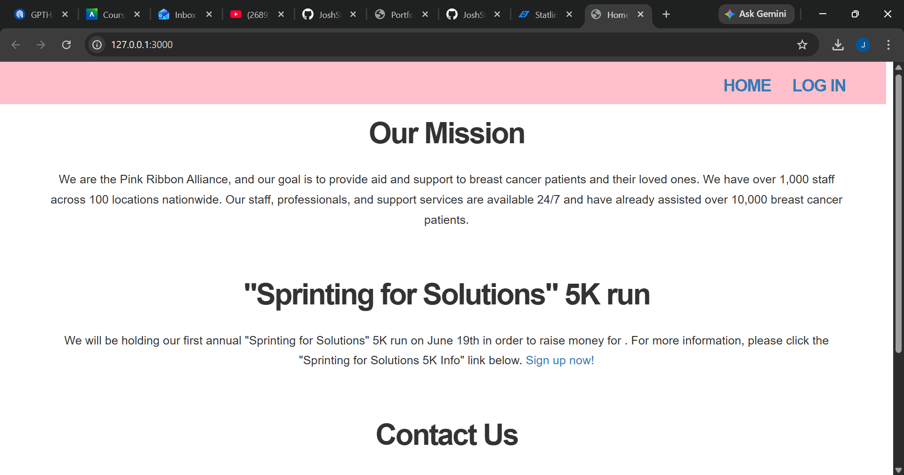

Portfolio
=========

Programming Projects
--------------------

*For access to my private project repositories, please [email me](mailto:joshsj17@gmail.com?subject=GitHub%20Access) with the subject line, GitHub Access.

---
### [Senior Project ](project1)

---
### [HL7 Family Tree Converter | CSCI 495](project2)

---
### [UI Final Project | CSCI 334](project3)

---
### [Tennis Game Simulator | CSCI 235](project4)

---

Ethics Papers
-------------

### [Ethics Paper CSCI 235](/pdf/ethics_paper_csci_235.pdf)

-   **Class: CSCI 235 Procederal Programming**  
-   **Grade: A**

### [Ethics Paper CSCI 301](/pdf/Ethics_Paper_315_presentation.pdf)

-   **Class: CSCI 301 Data Management** 
-   **Grade: A**

### [Ethics Paper 315](/pdf/ethics_paper_csci_315.docx)

-   **Class: CSCI 315 Data Structures** 
-   **Grade: A**

---

Presentations
-------------

### [CSCI 301 Scripting Languages Presentation](/pdf/CSCI_301_Srcipting Languages.pptx)

- **Class: CSCI 301 Scripting Languages** 
- **Grade: A**

### [Data Breach Presentation](/pdf/CYBERSECURITY_presentation.pptx)

- **Class: CSCI 400 Principles of Cybersecurity** 
- **Grade: A**

---

Page template forked from <a href="https://github.com/csu-cs/csci-portfolio">CSU-CS</a>

<!-- Remove above link if you don't want to attributive -->
