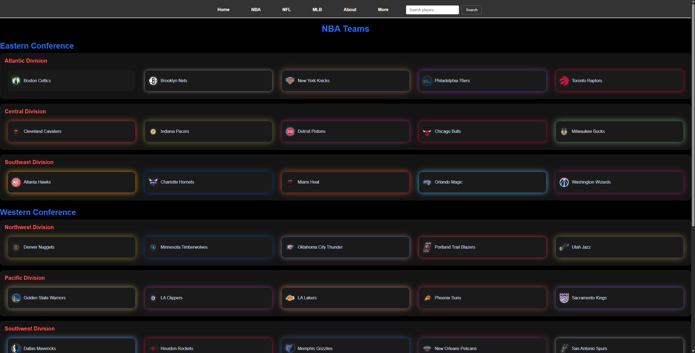
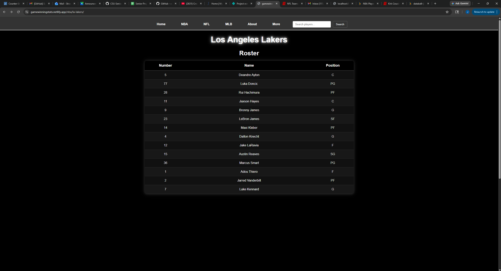
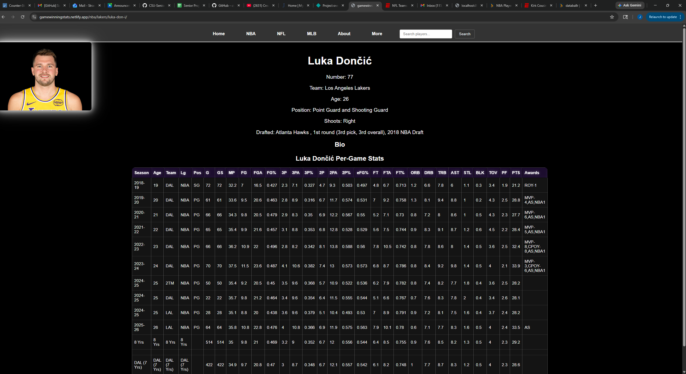
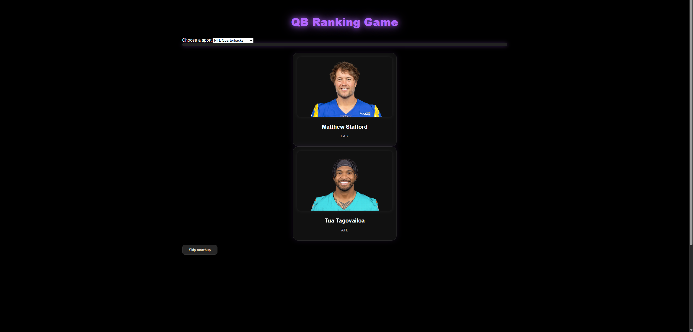
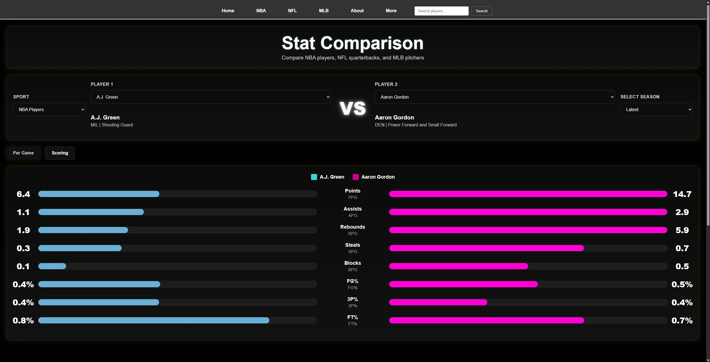

[Back to Portfolio](./)

GameWinningStats Website
===============

-   **Class:  CSCI 497-499** 
-   **Grade:** 
-   **Language(s): Python, HTML, JavaScript** 
-   **Source Code Repository:** [features/mastering-markdown](https://github.com/JoshStrad/SeniorProject)  
    (Please [email me](mailto:Joshsj17@gmail.comt?subject=GitHub%20Access) to request access.)

## Project description

This project will develop a sports analytics website that collects, processes, and displays player statistics from multiple sources. Some key features include web scraping from: Basketball Reference, Baseball Reference, and ESPN. There is data transformation into structured JSON files and dataframes, player search functionality, and player profile pages including: career stats, advanced analytics, rankings/comparisons, visualization of stats in charts/graphs

## How to compile and run the program

How to compile (if applicable) and run the project.

```bash
cd ./SeniorProject
python scripts/scrape-bbr.py
python scripts/scrape-babr.py
python scripts/scrape-espn.py
gatsby develop
```

To deploy, you connect github repository to Netlify and from there it will give all instructions to deploy

## UI Design
The first part of the UI is the homepage with navigation bar and search bar (see Fig 1), then we can navigate to a league by clicking on of the sports categories (see Fig 2). From there we can get a roster page of players.(see Fig 3). Then, you can view a player profile page to view thier stats and info (see Fig 4). There is also a ranking game and comparison tool for fans to use! (see Fig 5 and 6).

  
Fig 1. The website homepage

  
Fig 2. League page with all the teams from that league.

  
Fig 3. Team Roster page.


Fig 4. Player profile page.


Fig 5. Ranking Game.


Fig 6. Stat Comparison page.

## 3. Additional Documents


[Back to Portfolio](./)
