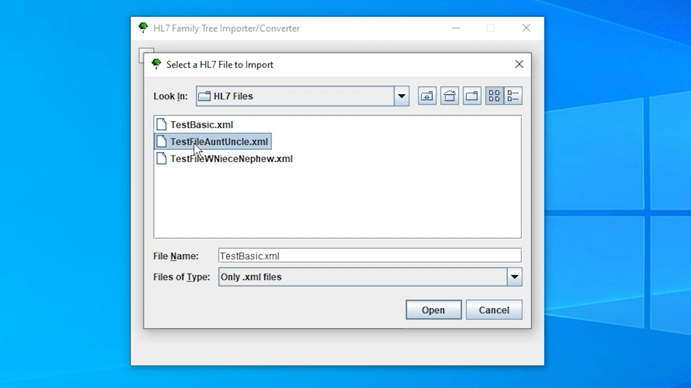
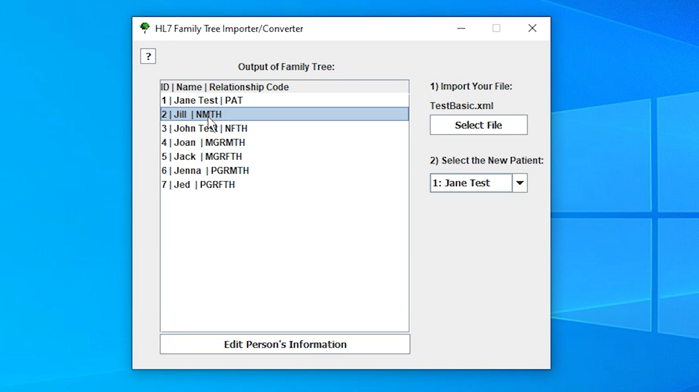
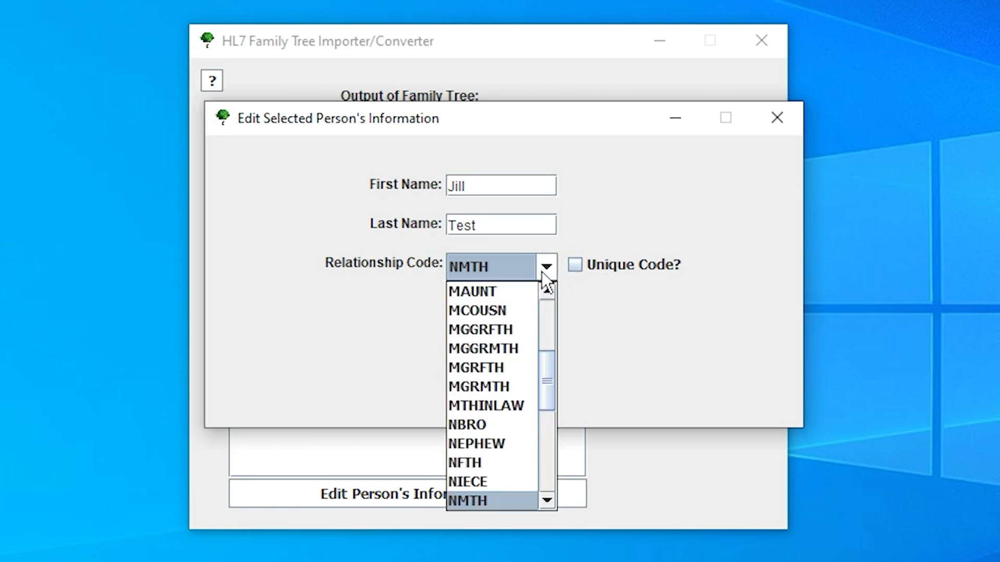
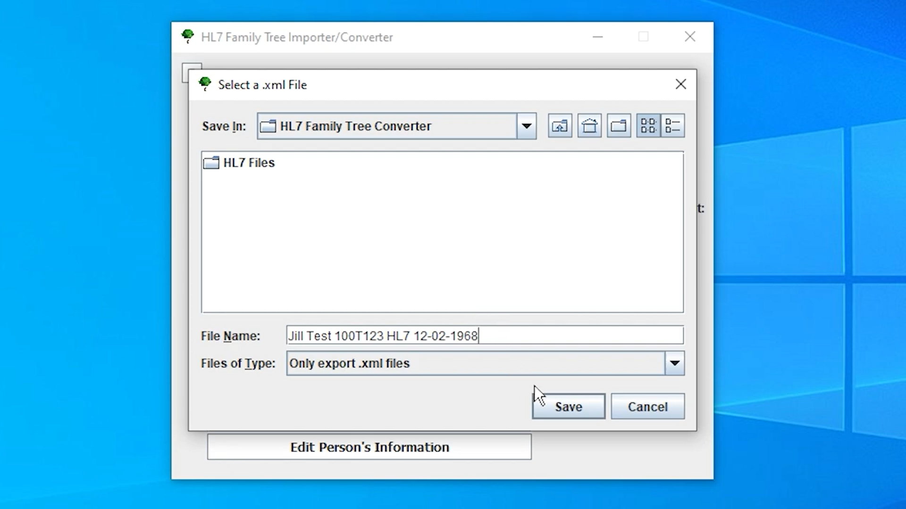

[Back to Portfolio](./)

HL7 Family Tree Converter 
===============

-   **Class:  CSCI 495** 
-   **Grade: A** 
-   **Language(s): Java** 
-   **Source Code Repository:** [Source Code Link](https://github.com/AlexThomp1/HL7FamilyTreeConverter)  

## Project description

The program uses the HL7 (.xml) files exported from the Family Tree interface to make a new family tree based on a person who exists on the tree. The purpose is to remove the redundant process of creating a brand new family tree for each person in the same family tree.

This program includes the features of:

Importing HL7 (.xml) files
Editing Information of People in the Tree
Re-orienting the Family Tree based on an existing person in the tree
Exporting HL7 (.xml) files
Simple to use User Interface
Able to be used on Windows (.exe) and other systems (.jar)
This project was a collaborative group project with: Developers: Alex Thompson, Nate Mixon, and Josh Stradford Managers: Evan Hack and Caleb Gillispie

## How to compile and run the program

How to compile (if applicable) and run the project.

Windows:
Go to the Releases section of this page
Download "HL7.Family.Tree.Converter.v1.0.Windows.exe" 2.1) If Windows states the file is not secure, click "More Info" at the bottom, and click "Run Anyway"
The program is now usable

Mac/Linux:
Go to the Releases section of this page
Download "HL7.Family.Tree.Converter.v1.0.Other.jar"
Ensure you have the latest version of Java installed 3.1) If Java is not installed, install it here based on your system: Java Installation Link
Open the downloaded file
The program is now usable

## UI Design
The first part of the UI is selecting a file of the patient that will reveal family members. (see Fig 1), then we can see the output of the family tree of the patient file we choose (see Fig 2). From there, we can update family members relationship to the patient and other background information.(see Fig 3). Then, you can export the saved family members into a new .xml file for storage in the system. (see Fig 5).

  
Fig 1. File selection

  
Fig 2. Output of Family Tree

  
Fig 3. Updating patient family info

Fig 4. .xml Selection for storage

## 3. Additional Documents
[Video Guide](https://www.youtube.com/watch?v=darrJ0l5nAI)

[Back to Portfolio](./)
