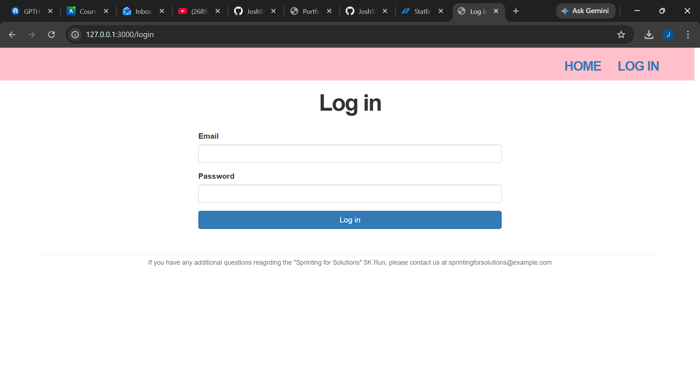
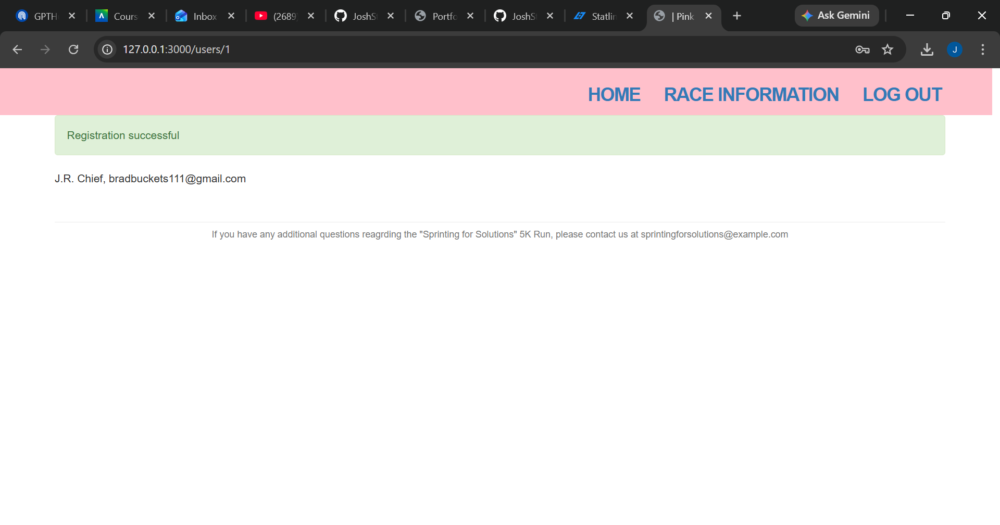
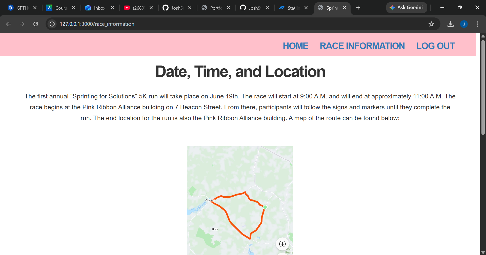
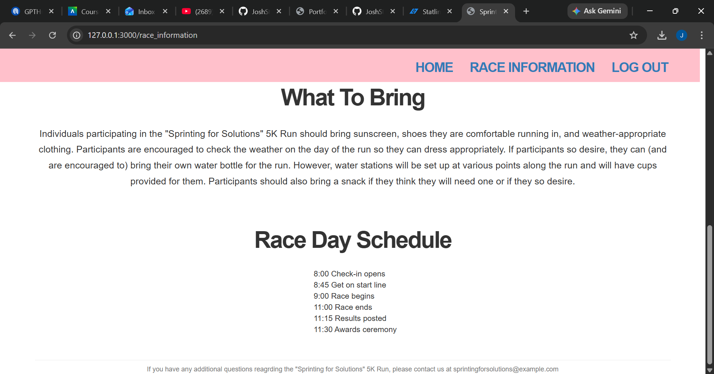

[Back to Portfolio](./)

UI Final Project 
===============

-   **Class:  CSCI 334 User-Interface Programming** 
-   **Grade: A** 
-   **Language(s): Ruby, HTML, Javascript, CSS** 
-   **Source Code Repository:** [Source Code Link](https://github.com/JoshStrad/ui-final-project)  

## Project description
By: Jefferey Wedding, Dylan Lee, and Josh Stradford

Our project is a website for a fictitious nonprofit that is holding a charity 5K run. 
The website contains information on the nonprofit, the race,
and provides users with the ability to register for the race.

Key Features
The website allows for the user to view the different pages of the website. These pages include the 'Home', 'Race Information', 'Register', and 'Admin' pages.

Home Page - This page informs the user about the nonprofit, contains a link to the 'Register' page, and proivides the user with three ways to contact the nonprofit.

Race Information Page - This page provides users with information pertaining to the race (i.e., race day schedule, map of the race route, what to bring).

Register Page - This page allows the user to register for the race by creating an account. The user will be required to enter their name, email address, age, and optional team name. The user will also be required to create a password for their account. If the user makes an Admin account, they will be able to view the admin page.

Admin Page - This page contains a table of of all registered runners. Additionally, an admin can make any other registered user and admin.

Once a user has registered, they will be able to log in and out of their account.

## How to compile and run the program

How to compile (if applicable) and run the project.

First, ensure that you have ruby installed on your machine. The commands to do so will look something like:

$ rvm get stable
$ rvm install 3.1.2
$ rvm --default use 3.1.2

Then, clone the repository on your machine by using the command:

git clone https://github.com/your_username_/ui-final-project.git

Once you have installed Ruby and cloned the repository, you can type:

rails server

in the terminal to start the server. The website will appear on your machine's localhost.

## UI Design
The goal of this project was to create a simple website for a fictitious nonprofit that a user could navigate and create an account for. 
To that end, one of our primary objectives was for the project was to have a simple, clean, and user-friendly UI. We used the adage "less is more" as guide, 
opting to keep the design fairly simple in order to prevent the user from becoming overloaded.

  
Fig 1. Homepage

  
Fig 2. Login Page

  
Fig 3. Registration Successful confirmation

Fig 4. Race Information

Fig 5. More race information

[Back to Portfolio](./)
