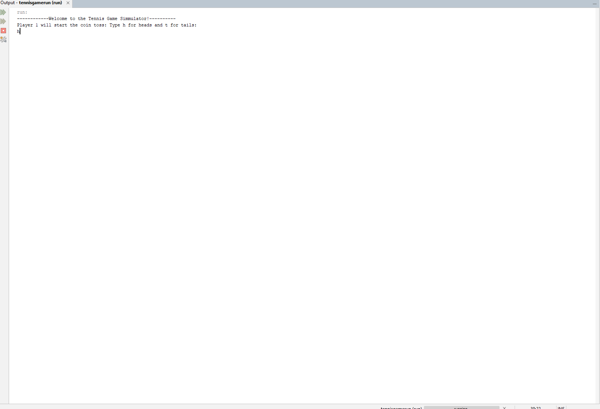
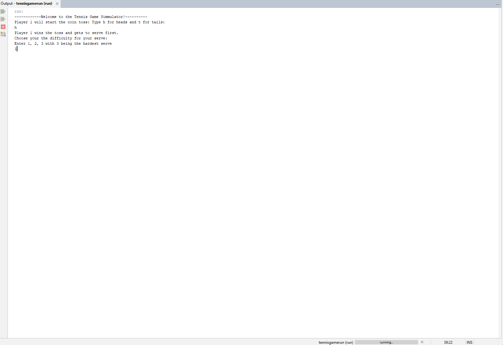
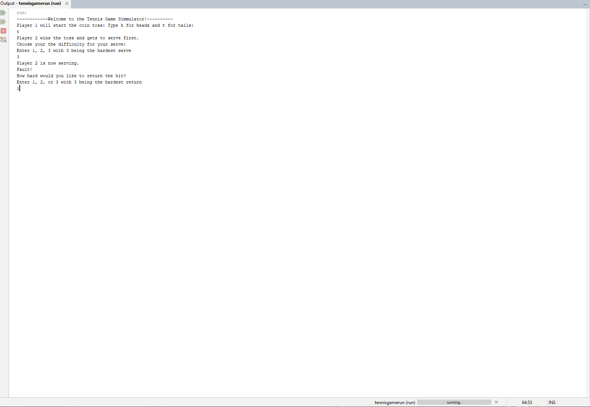
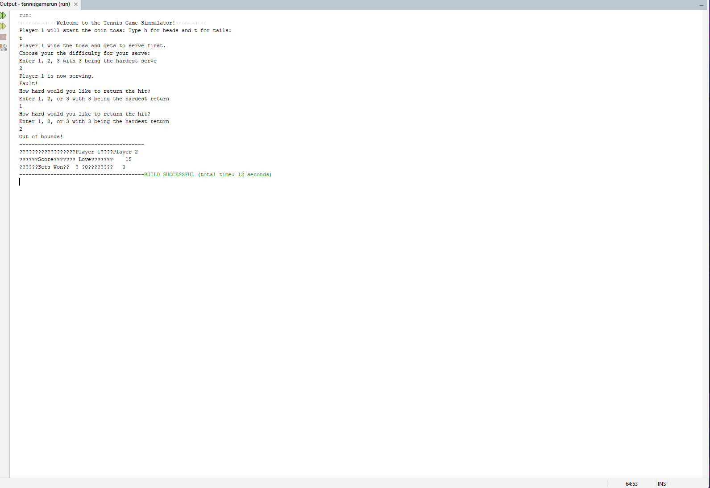
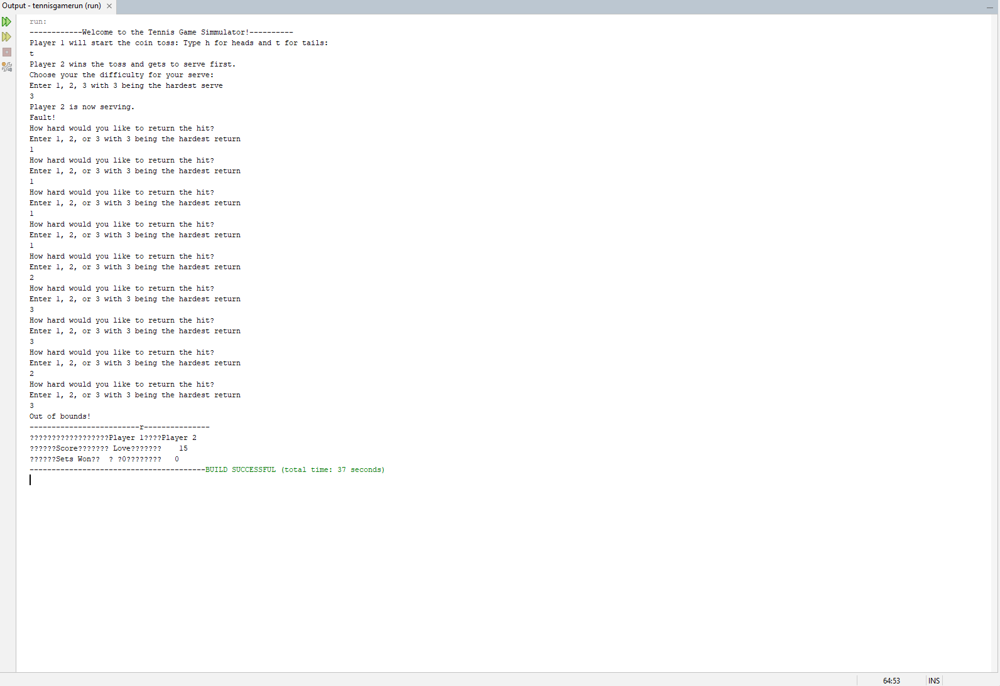

[Back to Portfolio](./)

Tennis Game Simulator 
===============

-   **Class:  CSCI 325 Object-Oriented Programming** 
-   **Grade: A** 
-   **Language(s): Java** 
-   **Source Code Repository:** [Source Code Link](https://github.com/JoshStrad/CSCI_325_Tennis_Game1.git)  

## Project description
By: Zach Wedding and Josh Stradford

The Tennis Game Simulator is a Java-based application designed to model and simulate a simplified tennis match between two players. The purpose of this project is to demonstrate object-oriented programming concepts such as classes, encapsulation, control flow, and user interaction through a realistic sports scenario.

The application begins with a start-of-game setup, where players are initialized and a coin toss determines which player serves first. The serving process incorporates user input to select the difficulty level of the serve, introducing an element of strategy and probability into the game.

The gameplay is driven by a combination of randomized outcomes and user decisions. After a serve, players attempt to return the ball by choosing how aggressively they want to hit it. The success of each return is determined using probabilistic logic, where higher difficulty increases the risk of hitting the ball out of bounds. This creates a balance between risk and reward, similar to real tennis gameplay.

A scoreboard system tracks points for both players and converts numeric scores into traditional tennis scoring terminology (Love, 15, 30, 40). It also maintains the number of sets won by each player, providing a structured representation of match progress.

The project is divided into multiple classes, each responsible for a specific part of the simulation:

StartOfGame handles initialization, player setup, and serving logic.
Return manages the return mechanics and determines whether a shot is successful.
AwardPoint is intended to assign points based on gameplay outcomes.
ScoreBoard tracks and displays the current score and match statistics.
TennisGame serves as the main driver class that coordinates the execution of the program.

Overall, this project simulates the core mechanics of tennis in a console-based environment while reinforcing fundamental programming concepts such as modular design, user input handling, and probabilistic decision-making.

## How to compile and run the program

How to compile (if applicable) and run the project.

Using NetBeans (Recommended)
Open Apache NetBeans IDE
Click File → Open Project
Select the cloned CSCI_325_Tennis_Game project folder
Ensure the main class is set:
Right-click the project → Properties
Go to Run
Set Main Class to TennisGame
Click Run Project or press F6

The program will compile and execute, prompting the user for input in the output console.

## UI Design
The Tennis Game Simulator uses a simple console-based user interface. Instead of using buttons, graphics, or windows, the program interacts with the user through text prompts in the NetBeans output console. The interface is designed to be straightforward and easy to follow. The program displays instructions, asks the user to enter choices, and then prints the results of each action. For example, the user may be asked to choose heads or tails for the coin toss, select a serve difficulty, or decide how hard to return the ball. The scoreboard is also displayed in text format. It shows each player’s current score using traditional tennis scoring terms such as Love, 15, 30, and 40. This allows the user to track the progress of the game while keeping the interface simple and beginner-friendly. Overall, the UI focuses on clarity, usability, and direct interaction through the command line.

  
Fig 1. Welcome to the Tennis Simulator coin toss.

  
Fig 2. Player who won coin toss chooses serve.

  
Fig 3. Fault simulation leading to return hit.

Fig 4. Fault Simulation leading to socre

Fig 5. Extended serve and return back and fourth

[Back to Portfolio](./)

